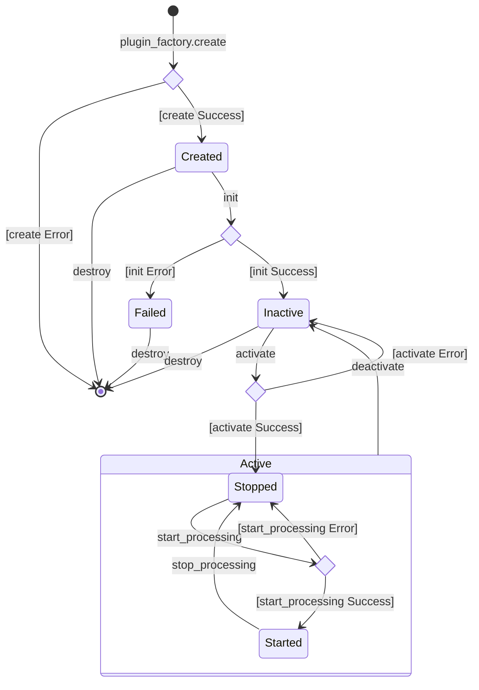

```mermaid
stateDiagram
state create <<choice>>
state init <<choice>>
state activate <<choice>>

state Created
state Failed
state Inactive

state Active {
    state Stopped
    state Started
    state start <<choice>>

    Stopped --> start: start_processing
    start --> Started: [start_processing Success]
    start --> Stopped: [start_processing Error]
    Started --> Stopped: stop_processing
}

[*] --> create: plugin_factory.create
create --> [*]: [create Error]
create --> Created: [create Success]

Created --> [*]: destroy
Created --> init: init

Failed --> [*]: destroy

init --> Failed: [init Error]
init --> Inactive: [init Success]

Inactive --> [*]: destroy
Inactive --> activate: activate

activate --> Stopped: [activate Success]
activate --> Inactive: [activate Error]

Active --> Inactive: deactivate

```